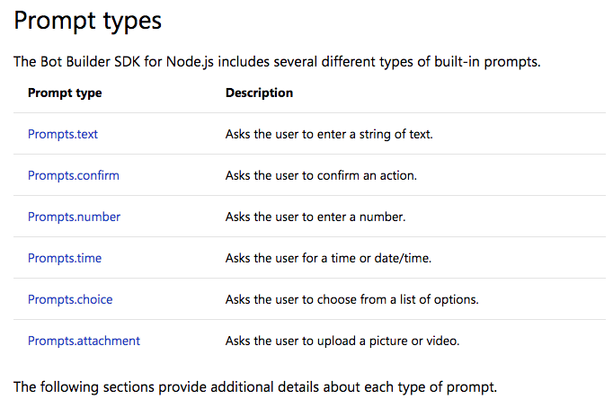

# Sinokor
This repository is for Sinokor chatbot Hackfest project.

## Develope Environment Setting
### Downloads File
* [Node (v8.11.2)](https://nodejs.org/ko/)
* [Visual Studio Code](https://code.visualstudio.com/)
* [Bot Framework Emulator](https://github.com/Microsoft/BotFramework-Emulator/releases)

### Dev Environment Setups
1. Local Dev Environmnet Setting
2. Create Azure Bot Service on Azure Portal  
3. CI/CD pipeline setup

## Bot Framework Example
1. Create Dialog
Link: [https://docs.microsoft.com/en-us/azure/bot-service/nodejs/bot-builder-nodejs-dialog-waterfall?view=azure-bot-service-3.0](https://docs.microsoft.com/en-us/azure/bot-service/nodejs/bot-builder-nodejs-dialog-waterfall?view=azure-bot-service-3.0)
```
bot.dialog('greetings', [
    // Step 1
    function (session) {
        builder.Prompts.text(session, 'Hi! What is your name?');
    },
    // Step 2
    function (session, results) {
        session.endDialog(`Hello ${results.response}!`);
    }
]);
```

2. Using Prompts


    [Example]
    ```
    // 1. Text Prompt
    builder.Prompts.text(session, "What is your name?");

    // 2. Confirm Prompt
    builder.Prompts.confirm(session, "Are you sure you wish to cancel your order?");

    // 3. Choice Prompt
    // ListStyle passed in as Enum
builder.Prompts.choice(session, "Which color?", "red|green|blue", { listStyle: builder.ListStyle.button });

// ListStyle passed in as index
builder.Prompts.choice(session, "Which color?", "red|green|blue", { listStyle: 3 });
    ```
3. Adaptive Card

4. Connect to API - QnA Maker
